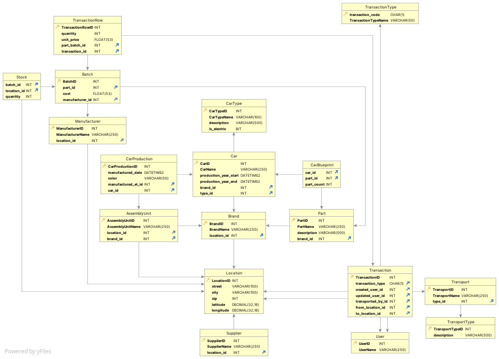

# P2. Database Design, Initial ERD

## Business Rules

- A `Car` is owned by a `CarBrand`, and is manufactured using multiple `Parts`, inside an `AssemblyUnit`
- A `CarBrand` may have multiple `AssemblyUnits`

## Entities

- `Car`: Represents a fully assembled car, the product of the automotive distribution process. A car will have an associated `CarType` and `CarBrand`.
- `CarType`: Represents the specific type/model of a car. Types helps categorize, manage and fulfill customer orders accurately.
- `CarBrand`: Represents a car brand or manufacturer.
  - `AssemblyUnit`: Represents the facility or unit responsible for assembling the components to create a complete car. 
- `Supplier`: Represents the entity that provide parts, components, or materials necessary for car assembly. Each is associated with an `Address' to manage locations and logistics effectively. 
- `Manufacturer`: Represents a manufacturer with attributes like `name` and `address_id`. It is related to an `Address` and has relationships with `Batch` (indicating the involvement in sourcing and producing parts) and `Purchase`.
- `Address`: Represents a physical address with attributes such as `street`, `city`, `zip`, `latitude`, `longitude` and is crucial for managing the logistics and transportation of parts and vehicles. Has relationships with `CarBrand`, `Supplier`, `Manufacturer`, and `AssemblyUnit`.
- `Transport`: Represents the mode of transport used for shipping parts, components, and vehicles and has attributes, `name` and `type_id`. It is related to a `TransportType` and has relationships with `Sales` and `Purchase`.
  - `TransportType`: Describes the type of transport with a `description`, providing additional details about the transportation methods. Has a relationship with `Transport`.
- `Part`: Represents individual components or parts used in car assembly. Parts are associated with Batches, indicating how they are sourced and managed within the inventory.
- `Batch`: Represents a specific batch of parts with attributes like `part_id`, `cost`, and `manufacturer_id`. It allows for precise tracking of part quantities and costs. It is related to `Part`, `Manufacturer`, and has relationships with `Stock`, `SalesRow`, and `PurchaseRow`.
- `Stock`: Represents the current inventory of a particular batch of parts and has attributes `batchId` and `quantity`, related to `Batch`. Tracking stock levels ensures that there are sufficient parts available for assembly
- `Sales`: Represents the sales transactions of cars with attributes `sale_to_id`, `sale_by_id`, and `transported_by_id`. It is related to `Transport`, `AssemblyUnit`, and `User` and has relationships with `SalesRow`.
  - `SalesRow`: Represents individual line items within a sales transaction, indicating which part batch is sold, the quantity sold, and the associated sale.  Has attributes like `part_batch_id`, `quantity`, and `sale_id`. It is related to `Batch` and `Sales` and helps maintain a detailed sales history. 
- `Purchase`: Represents the purchase transactions of parts and components from suppliers or manufacturers and has attributes `purchase_from_id`, `purchase_by_id`, and `transported_by_id`. It is related to `Transport`, `Manufacturer`, and `User` and has relationships with `PurchaseRow`. 
  - `PurchaseRow`: Represents a row in a purchase transaction with attributes like `part_batch_id`, `quantity`, and `purchase_id`. It is related to `Batch` and `Purchase`. This entity helps maintain a detailed purchase history.
- `User`:  individuals using the inventory management application. A user can make either a `Sale` or a `Purchase`, which helps track the responsible parties for various inventory-related activities.

## ER Diagram

## Database Diagram

