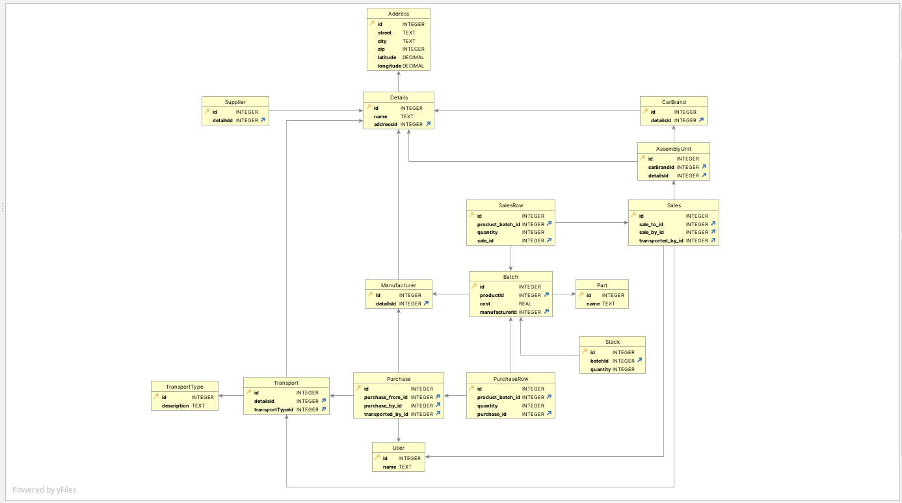

# Design Document

## Models

### Tables

- `Car` - Represents a car with details linking to `Brand`, `CarType`
- `CarType` - Represents a collection of car types
- `Brand` - Represents the brand of a car
- `Supplier` - Entity that supplies parts
- `Manufacturer` - Entity that manufactures parts
- `Location` - Table with location data for every entity in the database
- `Transport` - Entity responsible for moving a transaction from one `Location` to another
- `TransportType` - Type of the `Transport` enity
- `Part` - Entity that represents parts of a car in the supply chain
- `Batch` - Represents a collection that links a `Part` with a `Manufacturer` and the associated cost
- `Stock` - Table representing the amount of stock available for each `Batch` in each of the `Location`s
- `User` - User that Creates / Modifies `Transaction`s
- `AssemblyUnit` - An entity where a `Car` gets manufactured
- `CarBlueprint` - Entity representing the composition of `Car` based on number of `Part`
- `CarProduction` - When a car is produced, associated details is added to this table
- `Transaction` - Represents the 'header' section of a transaction
- `TransactionRow` - Represents each row associated with a `Transaction`
- `TransactionType` - Represents the type of `Transaction` (Sales/Purchase/etc.)
- `StockAudit` - When stock is updated, entries are added to this table for auditing

### Triggers

- `StockAuditTrigger` - Trigger that updates the `StockAudit` table based on inserts/updates/deletes on `Stock` table
- `StockUpdate` - Updates the `Stock` table whenever an entry is added/updated/deleted on the `TransactionRow` table
- `Prevent_CarProduction_Update_Delete` - Trigger for preventing updates/deletes on the `CarProduction` table
- `CarProduction_Stock_Consume` - When a car is produced (Inserted into `CarProduction` table), the stock from the assembly unit's location is automatically consumed

### Procedures

- `GetTotalCostForCar` - Gets an estimated cost to produce a car
- `GetPartsWithLowStock` - Gets a `@thresholdQuantity` input to give the parts that are low on stock
- `GetCarsInProduction` - Returns a list of cars in production
- `GetTransportsByCostRange` - Returns a list of transports that range between `@minCost` and `@maxCost`

### Functions

- `total_transaction_amount(@transaction_id int)` - returns total transaction amount for a given transaction ID
- `calc_distance(@lat1 float, @lon1 float, @lat2 float, @lon2 float)` - returns distance between a pair of latitudes and longitudes
- `calc_transaction_distance(@transaction_id int)` - returns the distance between the from location and to location of a transaction

## Final ERD

